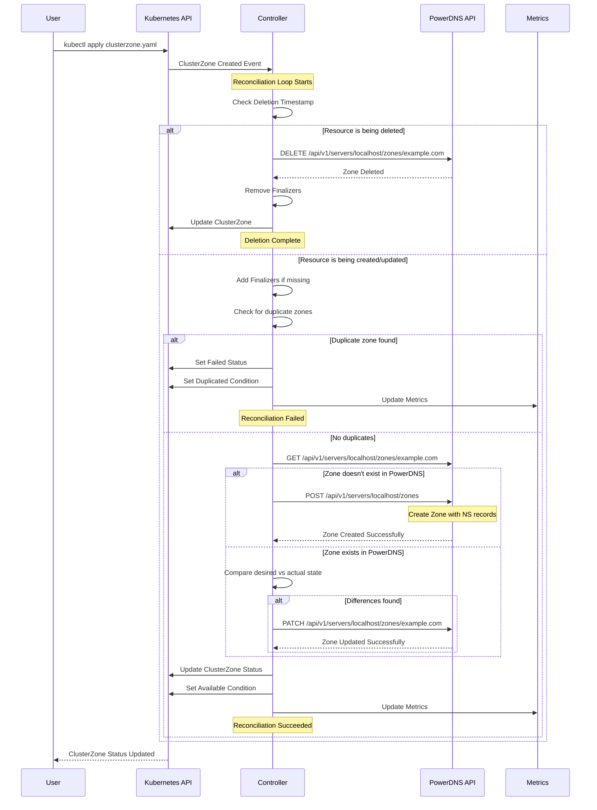

# ClusterZone deployment

## Specification

The `ClusterZone` specification contains the following fields:

| Field | Type | Required | Description |
| ----- | ---- |:--------:| ----------- |
| kind | string | Y | Kind of the zone, one of "Native", "Master", "Slave", "Producer", "Consumer" |
| nameservers | []string | Y | List of the nameservers of the zone |
| catalog | string | N | The catalog this zone is a member of |
| soa_edit_api | string | N | The SOA-EDIT-API metadata item, one of "DEFAULT", "INCREASE", "EPOCH", defaults to "DEFAULT" |

## Example

```yaml
apiVersion: dns.cav.enablers.ob/v1alpha2
kind: ClusterZone
metadata:
  name: helloworld.com
spec:
  nameservers:
    - ns1.helloworld.com
    - ns2.helloworld.com
  kind: Master
  catalog: catalog.helloworld
  soa_edit_api: EPOCH
```

## Reconciliation Flow

The following diagram illustrates the reconciliation flow for ClusterZone resources:


