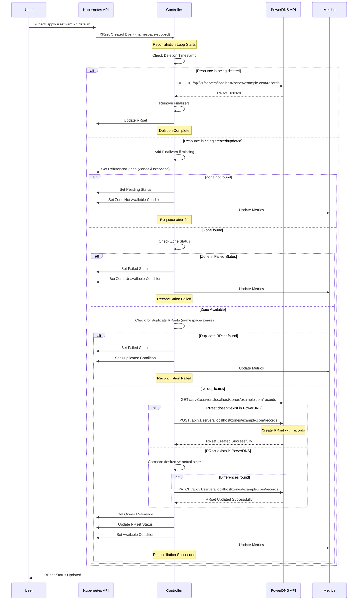

# RRset deployment

## Specification

The `RRset` specification contains the following fields:

| Field | Type | Required | Description |
| ----- | ---- |:--------:| ----------- |
| type | string | Y | Type of the record (e.g. "A", "PTR", "MX") |
| name | string | Y | Name of the record |
| ttl | uint32 | Y | DNS TTL of the records, in seconds
| records | []string | Y | All records in this Resource Record Set
| comment | string | N | Comment on RRSet |
| zoneRef | ZoneRef | Y | ZoneRef reference the zone the RRSet depends on |

The `ZoneRef` specification contains the following fields:

| Field | Type | Required | Description |
| ----- | ---- |:--------:| ----------- |
| name | string | Y | Name of the `ClusterZone`/`Zone` |
| kind | string | Y | Kind of zone (Zone/ClusterZone) |

## Example

```yaml
apiVersion: dns.cav.enablers.ob/v1alpha2
kind: RRset
metadata:
  name: test.helloworld.com
  namespace: default
spec:
  comment: nothing to tell
  type: A
  name: test
  ttl: 300
  records:
    - 1.1.1.1
    - 2.2.2.2
  zoneRef:
    name: helloworld.com
    kind: "Zone"
```

> Note: The name can be canonical or not. If not, the name of the `ClusterZone`/`Zone` will be appended

## Reconciliation Flow

The following diagram illustrates the reconciliation flow for RRset resources:

