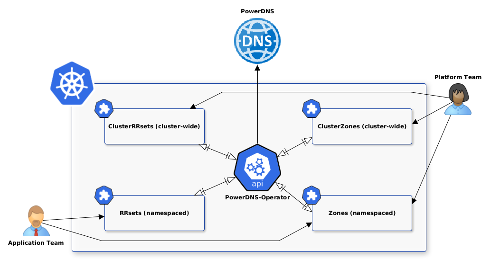

---
hide:
  - toc
---

# PowerDNS Operator Documentation



## What is PowerDNS Operator

PowerDNS Operator is a Kubernetes operator that bridges the gap between Kubernetes and PowerDNS, enabling you to manage DNS infrastructure using familiar Kubernetes patterns and tools. Instead of manually configuring PowerDNS zones and records, you can now use declarative Kubernetes resources that automatically sync with your PowerDNS server.

## Why PowerDNS Operator

We needed to offer DNS capabilities to users and considered relying on the PowerDNS-Admin project. However, we wanted a more flexible solution that could be natively integrated with our existing Kubernetes infrastructure. We were also looking for a solution that could be easily integrated with our GitOps workflow to automate the creation of DNS records as well as other resources such as Ingress, Services, etc.

Another reason is that the PowerDNS-Admin project is facing maintenance challenges and [will be rewritten in the future](https://github.com/PowerDNS-Admin/PowerDNS-Admin/discussions/1708).

The PowerDNS Operator provides a declarative approach to DNS management, unlike PowerDNS-Admin's imperative interface. It's a convenient way to offer self-service DNS capabilities to users, allowing them to create resources directly in the Kubernetes cluster. Additionally, you can use GitOps, Backstage or any Internal Developer Platform and connect it to the Kubernetes API server that contains the PowerDNS Operator if you don't want to grant direct access to the Kubernetes cluster.

## How It Works

The operator follows the standard Kubernetes operator pattern:

1. **Custom Resources**: You define DNS zones and records using Kubernetes Custom Resource Definitions (CRDs)
2. **Event-Driven Reconciliation**: The operator responds to Kubernetes events (create, update, delete) for these resources
3. **PowerDNS API**: When events are detected, the operator translates them into PowerDNS API calls
4. **Declarative Management**: The operator applies your Kubernetes declarations to PowerDNS during reconciliation events

This creates a seamless integration where your DNS infrastructure becomes part of your Kubernetes GitOps workflow.

!!! info "API Compatibility"
    This operator uses the official [PowerDNS API](https://doc.powerdns.com/authoritative/http-api/) and cannot be used with PowerDNS-Admin's custom API. Both can coexist but should not manage the same resources.


## Core Concepts

### DNS Zones
Zones represent the top-level domains you want to manage. The operator supports two types:

- **ClusterZones**: Available across all namespaces in your cluster
- **Zones**: Scoped to specific namespaces for better isolation

### DNS Records (RRSets)
Records define the actual DNS entries within zones. Like zones, records can be:

- **ClusterRRSets**: Global records accessible from any namespace
- **RRSets**: Namespace-scoped records for better security and organization

### Resource Relationships
Understanding how resources relate to each other is crucial:

```
ClusterZone (example.com)
├── ClusterRRset (www.example.com)
└── RRset (blog.example.com)
└── Zone (app.example.com)
    └── RRset (api.app.example.com)
```

## Architecture Overview

The operator consists of several key components:

- **Controllers**: Handle the reconciliation logic for each resource type
- **PowerDNS Client**: Manages communication with the PowerDNS API
- **RBAC Integration**: Provides fine-grained access control
- **Metrics**: Built-in monitoring and observability

## Getting Started

If you're new to PowerDNS Operator, we recommend following this path:

1. **[Overview](introduction/overview.md)** - Understand the architecture and design principles
2. **[Getting Started](introduction/getting-started.md)** - Installation and basic configuration
3. **[Resource Guides](guides/clusterzones/)** - Learn about each resource type in detail

## Use Cases

PowerDNS Operator is particularly valuable for:

- **GitOps Workflows**: Manage DNS alongside your application deployments
- **Multi-tenant Environments**: Isolate DNS management by namespace
- **Automated DNS**: Generate DNS records from Kubernetes services and ingresses
- **Infrastructure as Code**: Version control your entire DNS infrastructure
