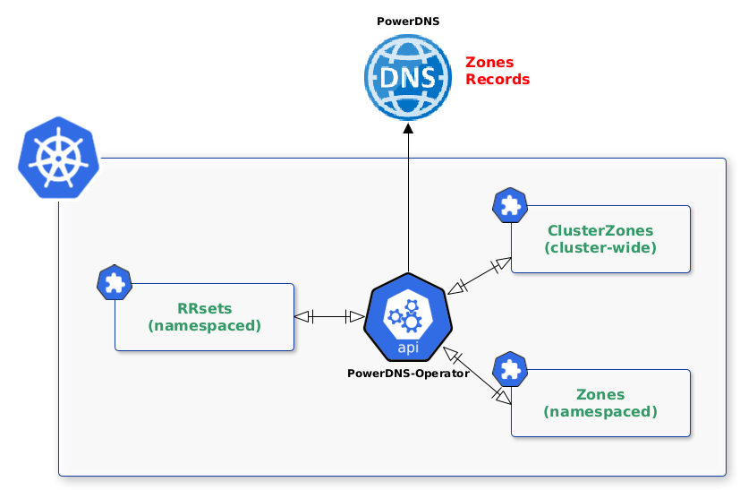
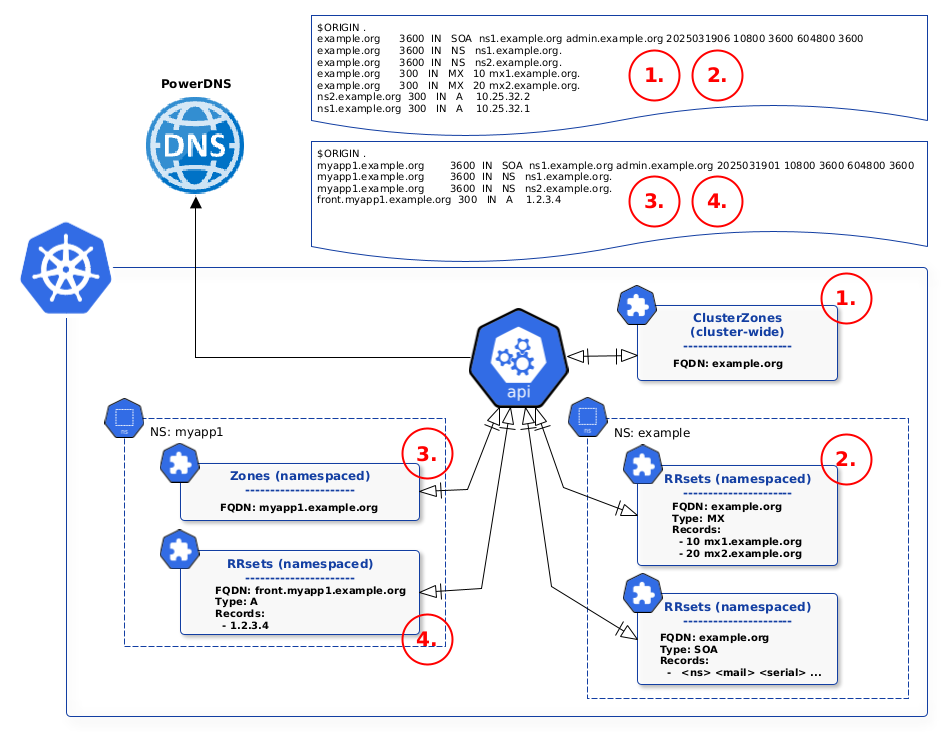

# Overview

## Architecture



The PowerDNS Operator extends Kubernetes with Custom Resource Definitions (CRDs) to manage PowerDNS zones and records declaratively. The operator watches for changes to these resources and reconciles them with the PowerDNS API.

## Resource Model



The operator supports four main resource types:

### 1. ClusterZone (Cluster-wide)
Platform teams create cluster-wide zones that are available across all namespaces.

```yaml
--8<-- "clusterzone-example.org.yaml"
```

### 2. ClusterRRset (Cluster-wide)
Platform teams create cluster-wide records for infrastructure services.

```yaml
--8<-- "clusterrrsets-example.org.yaml"
```

### 3. Zone (Namespace-scoped)
Application teams create namespace-scoped zones for their applications.

```yaml
--8<-- "zone-myapp1.example.org.yaml"
```

### 4. RRset (Namespace-scoped)
Application teams create records for their application services.

```yaml
--8<-- "rrsets-myapp1.example.org.yaml"
```
